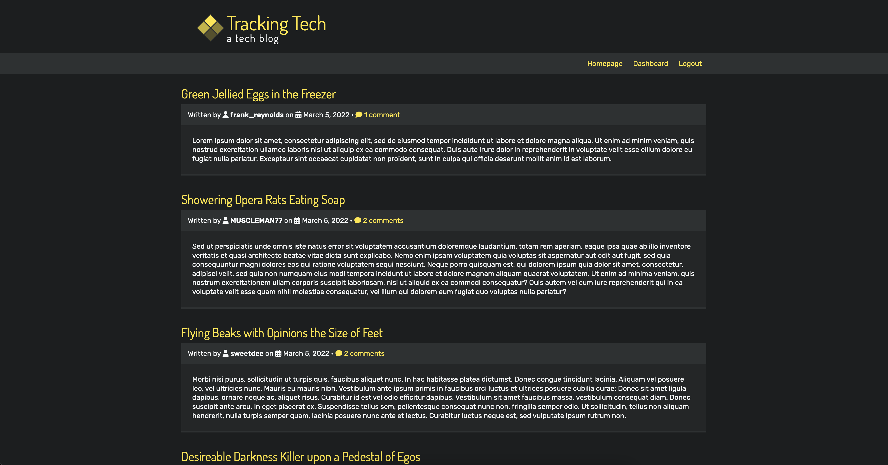

# Tech Blog
  
## Description
This tech blog is a simple CMS-style blog that displays posts and comments. Users can log in (or register, if they do not already have an account) to post blog entries and make comments on the site. Logged in users have a dashboard that not just allows them to create a new post, but access a list of their previous posts with links to view, edit, or delete those posts. After an hour of inactivity, users are logged out. This application uses Node.js with Express server, saving information to a MySQL database, and is deployed on Heroku.

## Table of Contents
* [Live Deployment](#live-deployment)
* [Screenshot](#screenshot)
* [Installation and Usage](#installation-and-usage)
* [Contributing](#contributing)
* [Tests](#tests)
* [Questions](#questions)

## Live Deployment
[View the live Tech Blog page with Heroku.](https://tech-blog-jcolecodes.herokuapp.com/)

## Screenshot


## Installation and Usage
To install and run this project, please follow these steps: 
1. Make sure you have [Node.js](https://nodejs.org) and [MySQL](https://dev.mysql.com/downloads/) installed.
2. Through the command line, go to the folder you wish this application's folder to be in.
3. Do `git clone` of the repository to get the application's files.
4. Run `npm run schema` to get the database.
5. To install all of the depenencies this application uses, run `npm install`.
6. Create a `.env` file containing: `DB_NAME=tech_blog_db`, along wtih your `DB_USER`, `DB_PASSWORD`, and a secret code `SECRET`.
7. To start the application, run `npm start`.
8. Open [localhost:3001](http://localhost:3001/) to see the local webpage.

## Contributing
If you would like to contribute to this project, you can do so by:
1. Forking the project. ([Learn how to fork.](https://docs.github.com/en/get-started/quickstart/fork-a-repo))
2. Creating a new feature branch, committing the changes, and pushing the branch.
3. Opening a [Pull Request](https://github.com/JColeCodes/tracking-tech/pulls).

You can also check the list of [Issues](https://github.com/JColeCodes/tracking-tech/issues).

Read the [Contributor Covenant Code of Conduct](https://www.contributor-covenant.org/version/2/1/code_of_conduct/).

## Tests
To easily test the application with a few users, posts, and comments, you can seed the database by running the following command:
```
npm run seed
```

## Questions
Tech Blog was created by [JColeCodes](https://github.com/JColeCodes). For inquiries regarding the project, please email the creator at [capauldi@gmail.com](mailto:capauldi@gmail.com).